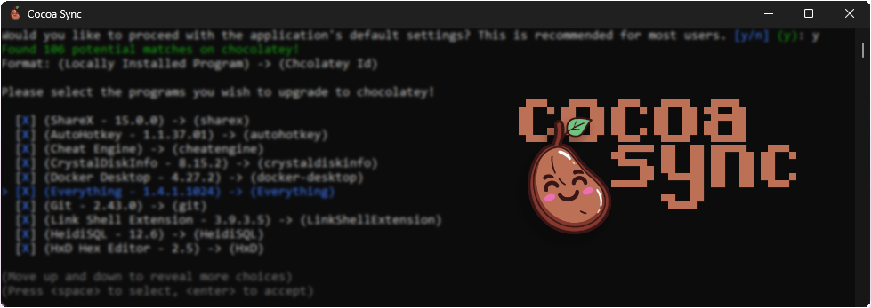

# Cocoa Sync



Cocoa Sync is a tool inspired by `choco sync` designed to manage locally installed programs using Chocolatey, a package manager for Windows. It identifies installed programs, searches for corresponding Chocolatey packages, and allows selection for installation via Chocolatey.

> **Please note**: Cocoa Sync does not directly "upgrade" installed programs to Chocolatey. It identifies potential matches on Chocolatey, and the user must manually select each valid result. The application then installs the selected packages, overwriting existing installations, effectively "upgrading" them to Chocolatey managed versions. This process may include some trial and error, as the search can yield incorrect results. To combat this, we've added the ability to add known mappings, which you can read about in the features section.

> I do not have access to `choco sync`, so I cannot compare it to the functionality of Cocoa Sync.


## Features

-  **Automatic Local Program Search**: Cocoa Sync identifies locally installed programs and attempts to match them with Chocolatey packages.
-  **Selection and Installation**: Users can select programs to "upgrade" to Chocolatey managed versions.
-  **Known Mappings**: Add known mappings like "Notepad++" -> "notepadplusplus" to improve search results. [Read more](#editing-known-mappings)
-  **Ignore Specific Publishers**: Ignore certain software publishers to clean up search results. [Read more](#ignoring-specific-publishers)

## Prerequisites

-  Windows (duh)
-  Administrator privileges
-  [Chocolatey](https://chocolatey.org/install) installed

## ⬇️ Download

You can download the latest release of Cocoa Sync from the [releases page](https://github.com/yourusername/cocoa-sync/releases/latest).

## Configuration

The configuration file and logs for Cocoa Sync is located at `%appdata%\cocoa-sync`. This file contains settings such as the list of publishers to ignore and known mappings of locally installed programs to Chocolatey packages.

## Editing Known Mappings

Cocoa Sync allows the user to add known mappings to improve the accuracy of program identification. For instance, the user can map "Notepad++" to "notepadplusplus" since the application fails to find the correct Chocolatey package.

The default list of known mappings includes:

```json
  "KnownMappings": [
    {
      "PackageName": "Notepad++",
      "ChocolateyId": "notepadplusplus"
    }
  ]
```

The user can customize this list by editing the config file. If you'd like to contribute to the default list of known mappings, you can find it in [Config.cs](https://github.com/Umbranoxio/cocoa-sync/blob/main/cocoa-sync/Data/Config.cs#L26) and make a pull request.

## Ignoring Specific Publishers

Cocoa Sync offers the ability to ignore specific (local) software publishers. This feature is particularly useful when dealing with publishers like Microsoft and Oracle, whose multiple SDKs can clutter the search results.

The default list of ignored publishers includes:

```json
  "PublisherIgnoreList": [
    "NVIDIA Corporation",
    "Microsoft Corporation",
    "Microsoft",
    "Python Software Foundation",
    "Oracle Corporation",
    "Adobe Inc",
    "Unknown",
    "Advanced Micro Devices, Inc.",
    "Realtek"
  ],
```

Users have the option to customize this list during setup, the user will be prompted to select from a list of default publishers to ignore. Adding custom publishers to this list is also possible.

If you'd like to contribute to the default list of ignored publishers, you can find it in [Config.cs](https://github.com/Umbranoxio/cocoa-sync/blob/main/cocoa-sync/Data/Config.cs#L13) and make a pull request.

## Developing

1. Clone the repository.
2. Open the solution in Visual Studio.
3. Build and run the project.

## Contributing

Pull requests are welcome. For major changes, please open an issue first to discuss what you would like to change.

## License

[MIT](https://github.com/Umbranoxio/cocoa-sync/blob/main/LICENSE.txt)
